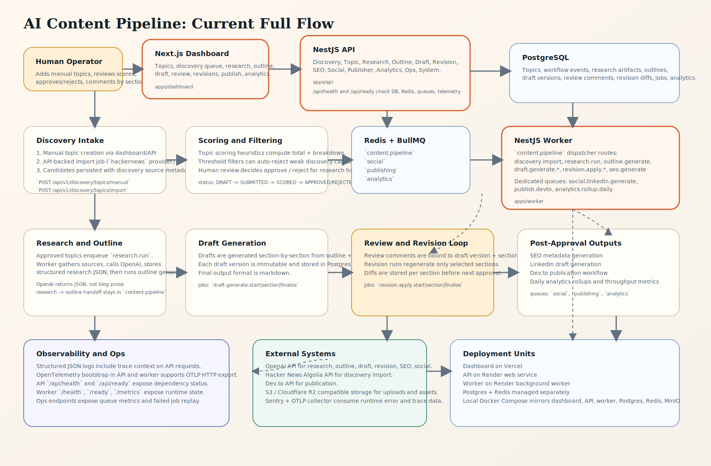

# AI Content Pipeline

Internal AI-powered content operations system for technical topic intake, research, drafting, revision, and distribution.



## What This Repo Is
This repo contains the full modular-monolith implementation for the content pipeline:
- `apps/api`: NestJS HTTP API
- `apps/worker`: BullMQ worker runtime
- `apps/dashboard`: Next.js internal dashboard
- `packages/shared-types`: shared contracts and blog document types
- `packages/shared-config`: shared TS env readers, ESLint presets, and TS base config

This file is the entry point. It stays high-level.

## Core Workflow
1. Create or discover a topic
2. Score and approve it
3. Run research
4. Generate an outline
5. Generate draft sections
6. Review and comment at section level
7. Revise selected sections only
8. Approve final content
9. Publish to Dev.to
10. Generate social distribution drafts

## Stack
- Frontend: Next.js
- API: NestJS + Prisma + PostgreSQL
- Worker: NestJS + BullMQ + Redis
- Storage: S3/R2-compatible object storage
- Deploy: Vercel + Render
- Monitoring: Sentry + OpenTelemetry hooks

## Quick Start
Local Docker runtime:
```bash
make dev-up
```

Host processes with Docker infra:
```bash
npm run dev:api
npm run dev:worker
npm run dev:dashboard
```

Dashboard sign-in:
- `http://localhost:3003/signin`

## Service Entry Points
- API health: `http://localhost:3001/api/health`
- API ready: `http://localhost:3001/api/ready`
- Worker health: `http://localhost:3002/health`
- Worker ready: `http://localhost:3002/ready`
- Dashboard: `http://localhost:3003/signin`

## Local Auth Seed
- `ADMIN`: `admin@example.com` / `AdminPass123!`
- `EDITOR`: `editor@example.com` / `EditorPass123!`
- `REVIEWER`: `reviewer@example.com` / `ReviewerPass123!`
- `USER`: `normal_user@example.com` / `UserPass123!`

## Important Files
- Runtime runbook: [RUN.md](./RUN.md)
- System summary: [summary.md](./summary.md)
- Docs index: [docs/README.md](./docs/README.md)
- Security model: [docs/security-model.md](./docs/security-model.md)
- Env reference: [docs/env-reference.md](./docs/env-reference.md)
- API service notes: [apps/api/README.md](./apps/api/README.md)
- Worker service notes: [apps/worker/README.md](./apps/worker/README.md)
- Dashboard service notes: [apps/dashboard/README.md](./apps/dashboard/README.md)

## Repo Conventions
- Root `.env` is the local runtime source.
- Root `npm run dev:*`, `start:*`, and `build:*` scripts build `@aicp/shared-config` first.
- Root and workspace tests run on Vitest 4 with shared config in `vitest.config.mts`.
- `apps/api/scripts/seed-demo.mjs` seeds the local user accounts and demo publish-ready topic.
- Service-local env access is centralized in:
  - `apps/api/src/config/env.ts`
  - `apps/worker/src/config/env.ts`
  - `apps/dashboard/src/config/env.ts`
- API and worker share `USER_TOKEN_ENCRYPTION_KEY` so publisher credentials can be encrypted in API and decrypted in worker jobs.
- Docker image specs live beside each service.
- Compose files live under `infra/docker`.

## Validation Status
- `npm audit` is currently clean: `0` vulnerabilities.
- `npm run lint`, `npm run typecheck`, and `npm run test` pass on the current branch.

## Where To Find Details
- Detailed commands: [RUN.md](./RUN.md)
- Architecture and implementation docs: [docs/README.md](./docs/README.md)
- Product/system intent: [summary.md](./summary.md)
